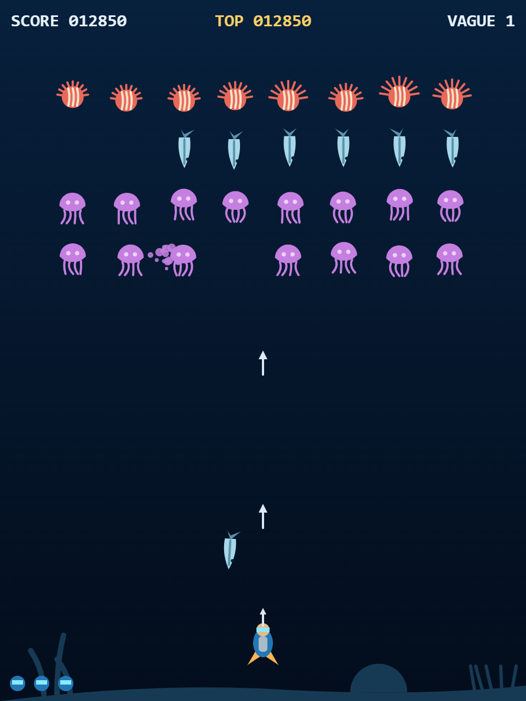

# 🤿 Reef Defender

<p align="center">
  
</p>

Un shoot'em up vertical dans l'esprit de **Galaga**, sur le thème de la plongée
sous-marine. Tu pilotes un plongeur armé d'un harpon et tu défends un récif
corallien contre des vagues de créatures marines qui entrent en formations
chorégraphiées… puis attaquent en piqué.

**100 % HTML5 Canvas + JavaScript vanilla.** Zéro dépendance, zéro build,
zéro asset externe : tous les sprites sont dessinés en code (vectoriel
flat rétro) et tous les sons sont synthétisés en Web Audio. Le projet est
aussi **pédagogique** : le code est intégralement commenté en français pour
montrer comment un jeu fonctionne, de la boucle de jeu aux courbes de Bézier.

## 🎮 Jouer

### En local sous Windows

Double-clique sur **`jouer.bat`** : il lance un mini serveur (PowerShell pur,
rien à installer) et ouvre le navigateur sur http://localhost:8420.

> Pourquoi un serveur ? Les modules ES6 (`<script type="module">`) sont
> bloqués par les navigateurs en `file://`. N'importe quel serveur statique
> fait l'affaire (`python -m http.server`, extension Live Server…).

### Sur un NAS / serveur web

Copie le dossier tel quel (sans `serve.ps1`, `jouer.bat` ni `.claude/`) dans
n'importe quel dossier servi en statique (nginx, Apache, Synology Web
Station…). C'est tout.

### Contrôles

| | Clavier | Tactile |
|---|---|---|
| Bouger | ← → ou Q / D (AZERTY) | glisser le doigt |
| Harponner | ESPACE | automatique |
| Voir les scores | V (sur l'écran titre) | — |

## 🐙 Le bestiaire

| Créature | PV | Points* | Comportement |
|---|---|---|---|
| **Méduse** | 1 | 50 | Lente, nombreuse, dangereuse au contact |
| **Barracuda** | 1 | 80 | Piqués secs et rapides, presque sans élan |
| **Poisson-lion** | 2 | 100 | Crache des épines depuis la formation et en piqué |
| **Murène** | 2 | 150 / **1000** | Voleuse de harpon (voir ci-dessous) |
| **Poulpe géant** | 4×3 + 12 | 4×250 + 3000 | Boss des vagues 4, 8, 12… |

\* Un ennemi abattu **en plein piqué** vaut double, comme dans Galaga.

### La murène et le double harpon

À mi-piqué, la murène s'arrête et déploie un **cône de capture** : tout
harpon tiré dedans est volé (tu tombes à 1 harpon à l'écran). Elle vaut
alors 1000 points — détruis-la, rattrape le harpon qui coule, et tu tires
**en double** jusqu'à ta prochaine mort. Pendant le cône, tirer est un
pari : c'est peut-être toi qui lui donnes ton harpon.

### Le poulpe géant

Sa tête est **blindée tant qu'il lui reste des tentacules** : détruis le
bout de chacune (3 coups), puis vise la tête aux yeux rouges. Il fouette
avec ses tentacules et crache de l'encre à visée libre.

### Power-ups (~8 % des ennemis détruits)

- **‖ Tir rapide** — cadence ×2,5 pendant 8 secondes
- **○ Bouclier de bulles** — absorbe un impact
- **≋ Bombe sonar** — nettoie l'écran… pour la moitié des points

## 🔧 Architecture

```
index.html, style.css      la page et le letterboxing
js/
├── main.js                point d'entrée : assemble le moteur, lance la boucle
├── config.js              ⭐ TOUTES les constantes d'équilibrage, commentées
├── engine/                la boucle (delta time), l'écran logique 480×640,
│                          le clavier + tactile, l'audio synthétisé, les
│                          collisions (cercles), les particules, les scores
├── entities/              plongeur, ennemis, boss, projectiles, power-ups
├── waves/                 ⭐ les vagues en DONNÉES pures : chaque escadron
│                          déclare son chemin de Bézier, son délai, ses cases ;
│                          paramétrisation par longueur d'arc = vitesse constante
└── scenes/                la machine à états : titre → jeu → game over
                           → saisie d'initiales → tableau des scores
```

Deux fichiers à ouvrir en premier si tu explores le code :

- **`js/config.js`** — change une valeur, recharge, observe. Essaie
  `harpon.cadence: 0.1` ou `boss.pvTete: 3`.
- **`js/waves/waves.js`** — invente ta propre vague en ajoutant un objet,
  sans écrire une ligne de logique.

Astuce debug : ouvre la console (F12) et tape `jeu.scenes.actuelle` —
tout l'état du jeu est exposé. `jeu.scenes.actuelle.score = 9999` fonctionne,
tricheur.

## 📈 High scores

Top 10 sauvegardé dans le `localStorage` du navigateur, saisie des
initiales à 3 lettres façon borne d'arcade. La difficulté monte à chaque
vague (piqués plus fréquents, groupes plus gros) et tout accélère de 15 %
à chaque cycle complet des 4 chorégraphies.

---

*Écrit avec [Claude Code](https://claude.com/claude-code) — un projet
père-fils pour découvrir comment un jeu vidéo fonctionne sous le capot.*
